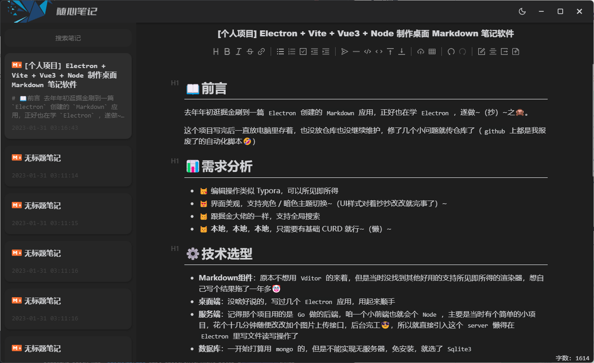
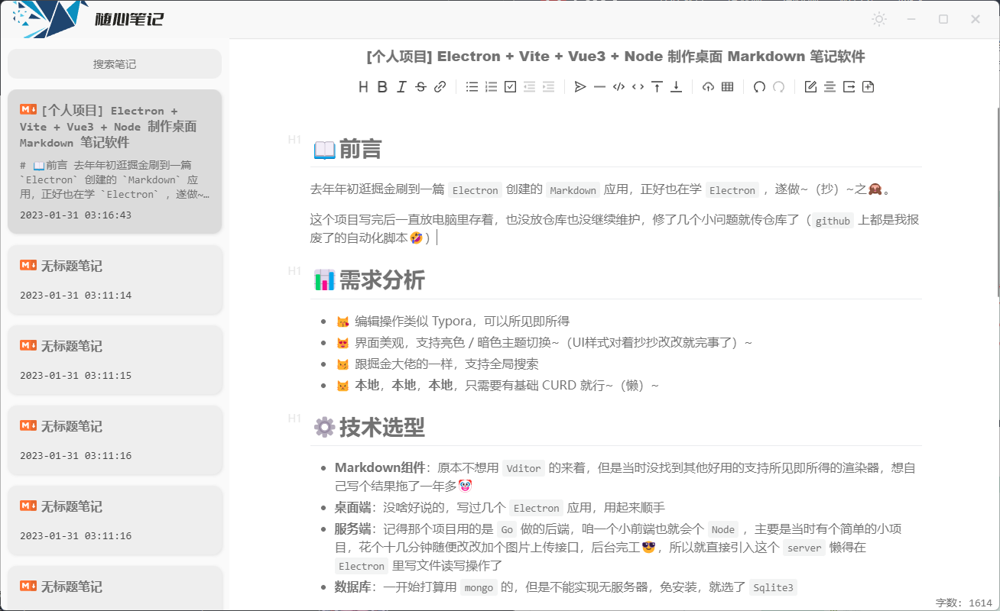

# 📖前言
去年年初逛掘金刷到一篇 `Electron` 创建的 `Markdown` 应用，正好也在学 `Electron` ，遂做<del>（抄）</del>之🙈。

这个项目写完后一直放电脑里存着，也没放仓库也没继续维护，修了几个小问题就传仓库了，<del>`github` 上都是我报废了的自动化脚本</del>🤣


# 📊需求分析

- 😽 编辑操作类似 Typora，可以所见即所得
- 😻 界面美观，支持亮色 / 暗色主题切换（UI样式对着抄抄改改就完事了）
- 😼 支持全局搜索
- 😾 **本地**，**本地**，**本地**，只需要有基础 CURD 就行（懒）


# ⚙️技术选型

- **Markdown组件**：原本不想用 `Vditor` 的来着，但是当时没找到其他好用的支持所见即所得的渲染器，想自己写个结果拖了一年多🤡
- **桌面端**：没啥好说的，写过几个 `Electron` 应用，用起来顺手
- **服务端**：v1.0.1 已经去除了 `Node` 搭建的后端，改为了使用主进程直接操作数据库，然后通过 `ipc` 通信模拟请求。原本是想着后端有现成的模板，直接引进去就完事，现在想想也怪，`Electron` 都集成 `Node` 了，还专门开一个 `WebServer` 加大开销，真是脑抽了😂，带后台的版本存入 server 分支
- **数据库**：一开始打算用 `mongo` 的，但是不能实现无服务器、免安装，就选了 `Sqlite3` 


# 🛠开发调试

```shell
# 下载依赖（推荐cnpm，electron安装容易报错）
npm install

# better-sqlite3可能编译报错
npm install -g node-gyp
## 方案1
cnpm rebuild --runtime=electron --target=19.1.7 --disturl=https://atom.io/download/atom-shell --abi=106
## 方案2
cd .\node_modules\better-sqlite3\ 
node-gyp rebuild --release --target=19.1.7  --dist-url=https://electronjs.org/headers

# 开发调试
npm run electron:serve

# 打包
npm run electron:build
```


# 🎨预览

暗色主题：



亮色主题：



# ♨️后记

> Q：小伙子你说对着抄，有自己写的吗

A：可以说就 copy 了样式设计，后在基础功能上加了点小东西，比如字数统计、虚拟列表、主题切换、过度动画等，并修复了几个操作 bug，可以打十分甚至九分！


> 搞这玩意真的很多坑

- better-sqlite3 编译报错：真的坑啊这东西，掘金、github 到处找解决方法，最后是去的 [Stack Overflow](https://stackoverflow.com/questions/73752141/cannot-install-better-sqlite3-with-build-from-source-because-electron-abi-mismat) 找到了用 `node-gyp` 的方法完成了编译

- **v1.0.1 已经去除了 server 并修改了一些路径，可以继续加密打包力😋**

  打包后路径及 fs 模块出错：打包后项目都在 `app.asar` 文件里，一些路径出错改改就好了，问题是 fs 模块直接嗝屁了，下面是官方中文文档原话

  > #### 归档文件是只读的
  >
  > 归档文件中的内容不可更改，所以 Node APIs 里那些会修改文件的方法在使用 ASAR 文件时都无法正常工作.

  最后在 `package.json` 中添加字段 `"asar": false` 取消 asar 加密解决

- 打包后文件过大：打包后算免安装包文件夹大概到 300 多 mb 了，实在是不敢恭维，看 `app.asar` 里打包了整个 `node_modules`，后通过修改 `electron-builder` 配置优化到了 230 多 mb

